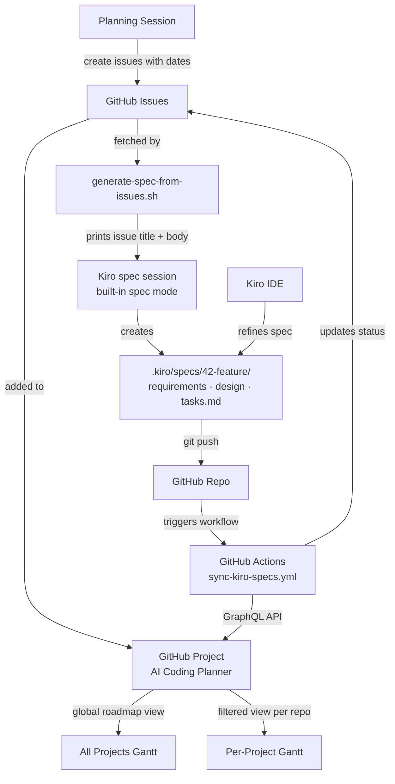
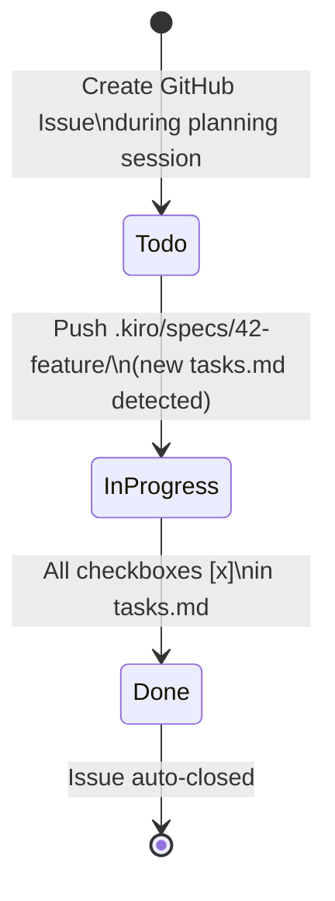
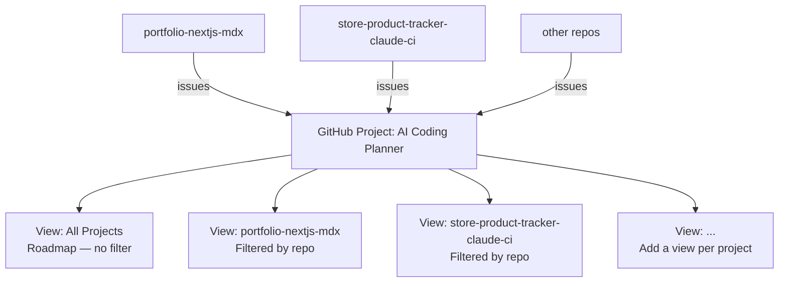
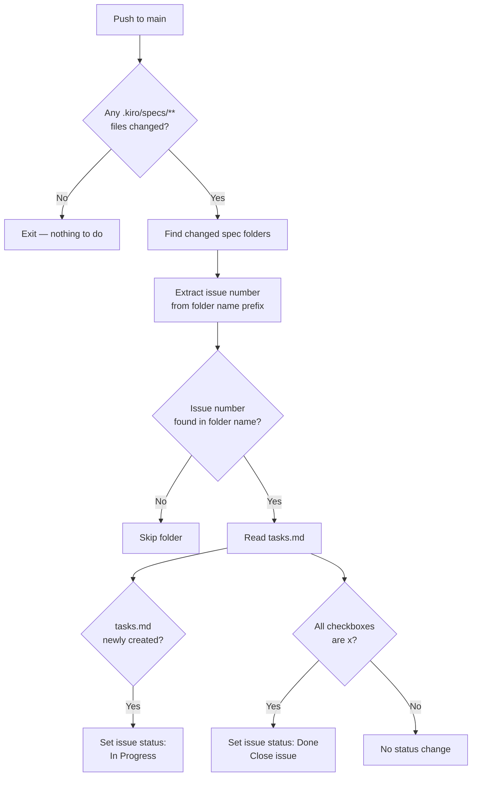
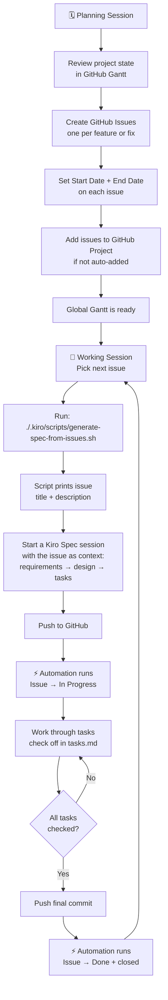
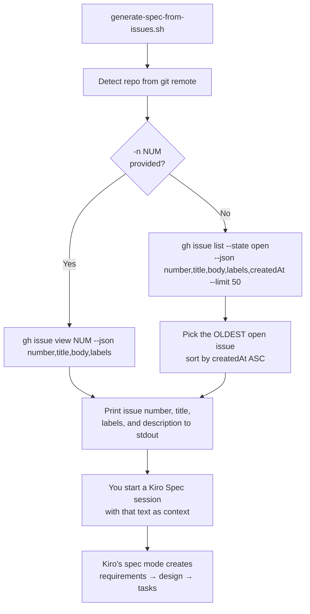
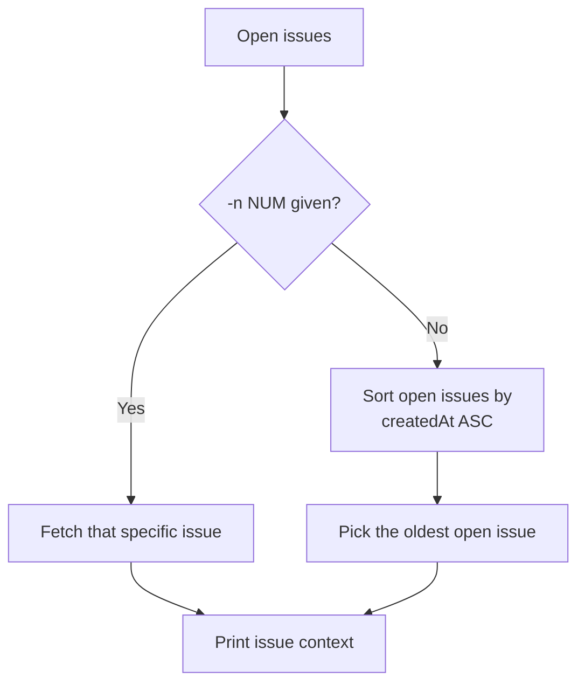
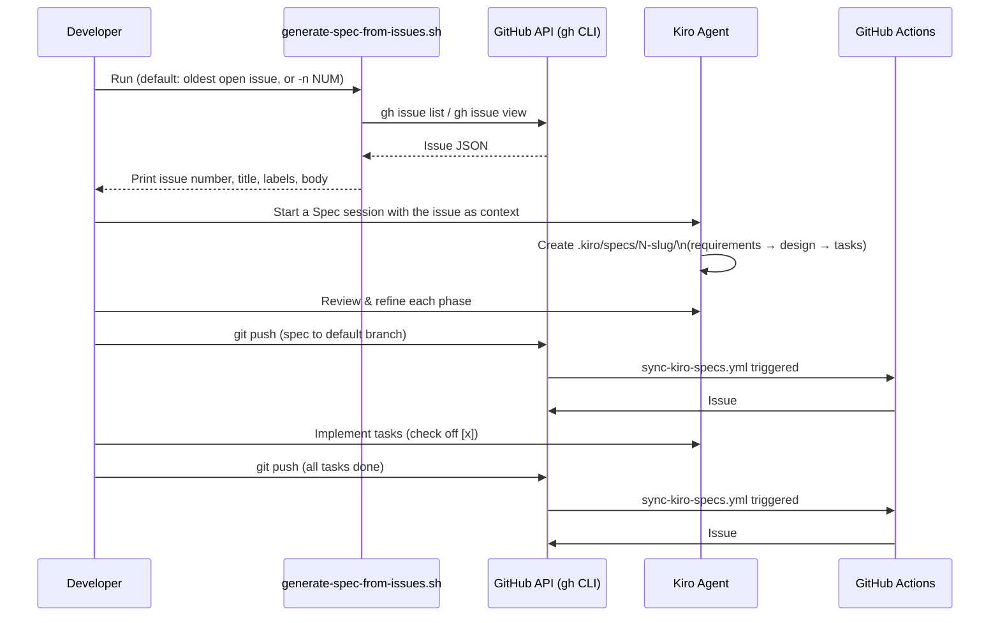
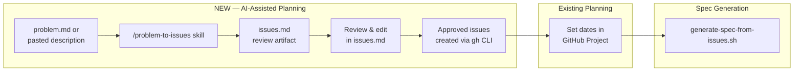

# Side Project Workflow Guide

A unified system for planning, tracking, and automating progress across all side projects using GitHub Projects, Kiro IDE, and GitHub Actions.

---

## Table of Contents

1. [System Overview](#1-system-overview)
2. [Components](#2-components)
3. [GitHub Projects Setup](#3-github-projects-setup)
4. [gh CLI Setup](#4-gh-cli-setup)
5. [Naming Convention](#5-naming-convention)
6. [GitHub Actions Automation](#6-github-actions-automation)
7. [Day-to-Day Workflow](#7-day-to-day-workflow)
8. [Pending Tasks & Recurring Configs](#8-pending-tasks--recurring-configs)
9. [Spec Generation from Issues](#9-spec-generation-from-issues)
10. [AI-Assisted Issue Generation from Problem Statements](#10-ai-assisted-issue-generation-from-problem-statements)
11. [New Project Bootstrap](#11-new-project-bootstrap)
12. [Tech Stack Installation](#12-tech-stack-installation)

---

## 1. System Overview

The goal is a lightweight project management system that:

- Gives a **global Gantt view** across all side projects
- Gives a **per-project Gantt view** for focused tracking
- **Automatically updates issue status** when a Kiro spec is created or completed
- **Fetches pending GitHub issues as ready-to-use context** for Kiro's built-in spec sessions
- Requires minimal manual overhead — planning happens at feature granularity, not task level

### Architecture



### Issue Lifecycle



---

## 2. Components

| Component                        | Role                                                                                                                                                                       |
| -------------------------------- | -------------------------------------------------------------------------------------------------------------------------------------------------------------------------- |
| **GitHub Issues**                | One issue per feature or bug fix. The single source of truth for what needs to be built.                                                                                   |
| **GitHub Projects (Roadmap)**    | Gantt-style visualization of all issues with start/end dates.                                                                                                              |
| **GitHub Actions**               | Automation that watches `.kiro/specs/**` and updates issue status on push.                                                                                                 |
| **Kiro Specs**                   | Generated per feature when work begins. Folder name encodes the issue number.                                                                                              |
| **gh CLI**                       | Used locally and in Actions to interact with GitHub API and Projects.                                                                                                      |
| **generate-spec-from-issues.sh** | Script that fetches a pending issue and prints its title + description as context for a Kiro spec session. It does NOT create spec files — Kiro's built-in spec mode does. |

---

## 3. GitHub Projects Setup

### Project details

| Setting                 | Value                            |
| ----------------------- | -------------------------------- |
| Project name            | AI Coding Planner                |
| Project number          | 2                                |
| Owner                   | jpmti2016                        |
| Project ID              | `PVT_kwHOAVFSGM4BY7DU`           |
| Status field ID         | `PVTSSF_lAHOAVFSGM4BY7DUzhT9Y3I` |
| "In Progress" option ID | `47fc9ee4`                       |
| "Done" option ID        | `98236657`                       |

### Views structure

The project uses a single GitHub Project with multiple saved views — one global and one per project. This means issues are added once and appear in all relevant views automatically.



### Fields

| Field      | Type          | Purpose                                              |
| ---------- | ------------- | ---------------------------------------------------- |
| Status     | Single select | `Todo` / `In Progress` / `Done`                      |
| Start Date | Date          | Start of planned work — used for Gantt bar left edge |
| End Date   | Date          | Target completion — used for Gantt bar right edge    |

### Adding a new project to the Gantt

When onboarding a new project:

1. Add the workflow file to the repo (see [Section 6](#6-github-actions-automation))
2. Enable Actions read/write permissions in the repo settings
3. Open the GitHub Project → **+ New view** → Roadmap
4. Name it after the repo
5. Filter: type `repo:jpmti2016/<repo-name>` in the filter bar
6. Set date fields: Start Date / End Date
7. Save the view

---

## 4. gh CLI Setup

The `gh` CLI is used both locally (for querying projects) and inside GitHub Actions (for updating issue status).

### Installation (Linux)

```bash
# gh is available via apt on Ubuntu
sudo apt install gh

# Or without sudo, install binary to ~/.local/bin
mkdir -p ~/.local/bin
curl -sL "https://github.com/cli/cli/releases/download/v2.72.0/gh_2.72.0_linux_amd64.tar.gz" \
  | tar xz -C /tmp && mv /tmp/gh_2.72.0_linux_amd64/bin/gh ~/.local/bin/

# Add to PATH if needed
echo 'export PATH="$HOME/.local/bin:$PATH"' >> ~/.bashrc && source ~/.bashrc
```

### Authentication

```bash
# Initial login
gh auth login
# Choose: GitHub.com → HTTPS → Login with a web browser

# Add project scope (required for GitHub Projects API)
gh auth refresh -s project

# Verify
gh auth status
# Expected scopes: gist, project, read:org, repo, workflow
```

---

## 5. Naming Convention

The automation links a Kiro spec folder to a GitHub Issue using the **issue number as a prefix** in the folder name.

```
.kiro/specs/<issue-number>-<short-description>/
├── requirements.md
├── design.md
└── tasks.md      ← automation watches this file
```

### Examples

| GitHub Issue         | Spec folder                      |
| -------------------- | -------------------------------- |
| #42 — Add dark mode  | `.kiro/specs/42-dark-mode/`      |
| #7 — Fix broken auth | `.kiro/specs/7-fix-broken-auth/` |
| #15 — Blog post list | `.kiro/specs/15-blog-post-list/` |

### Rules

- Folder name **must start with the issue number** followed by a dash
- Everything after the dash is free-form (use kebab-case)
- The `tasks.md` file must use checkbox syntax: `- [ ] task` and `- [x] task`

---

## 6. GitHub Actions Automation

### Workflow file

Location in every repo: `.github/workflows/sync-kiro-specs.yml`

The workflow triggers on a push **to the default branch (`main`)** that touches
`.kiro/specs/**` and does the following. Pushes on feature branches are
intentionally ignored: issue/Project status is canonical and driven by `main`, so
in-progress work on a side branch must not flip Project status.



### Repo permissions required

Each repo needs two Actions settings configured at
`https://github.com/jpmti2016/<repo>/settings/actions`:

**1. Actions permissions** (which actions are allowed to run)

Select **"Allow jpmti2016 actions and reusable workflows"**. This is the most
secure option that still works, because:

- The workflow is authored by you, lives inside the repo running it, and pulls
  in no third-party actions.
- The manual `git clone` step (see below) means we do **not** depend on
  `actions/checkout` or any other action from outside your account.

**2. Workflow permissions** (what the workflow's token can do)

1. Scroll to **Workflow permissions**
2. Select **Read and write permissions**
3. Save

#### About the `actions/checkout` policy error

If a workflow uses `actions/checkout@v4` while **"Allow jpmti2016 actions and
reusable workflows"** is selected, GitHub rejects the run with:

```
The action actions/checkout@v4 is not allowed in jpmti2016/<repo> because all
actions must be from a repository owned by jpmti2016.
```

**Cause:** the restrictive policy blocks every action that is **not** owned by
`jpmti2016` — and `actions/checkout` is owned by the `actions` org, not by you.
The file living in your own repo is irrelevant; the policy is about who **owns
the action being called**, not where the workflow file sits. (`actions/checkout`
is published by GitHub's `actions` organization, so it is always "external" to
your account.)

You have two ways to resolve it:

- **Recommended (used here):** avoid `actions/checkout` entirely. The
  `sync-kiro-specs.yml` workflow does a plain `git clone` of the triggering
  branch using the built-in `GITHUB_TOKEN` (exposed as `REPO_TOKEN`), so it never
  calls an external action and the strict "jpmti2016 only" policy is satisfied.
  The clone uses **full history** (no `--depth`) and the changed-spec detection
  diffs the **whole push range** (`github.event.before..GITHUB_SHA`, with an
  empty-tree fallback for new branches) rather than only `HEAD~1..HEAD`. This way a
  spec is still detected when a push contains several commits and `tasks.md` is not
  the final commit.
- **Alternative:** switch the setting to **"Allow jpmti2016, and select
  non-jpmti2016, actions and reusable workflows"** and allow-list
  `actions/checkout@*`. This is looser and unnecessary given the clone approach.

### Project status automation: PROJECT_TOKEN is required

The workflow runs in **full status mode** — it drives all three Gantt states:
**Todo → In Progress → Done**. Tracking the **In Progress** state (set when a
spec's `tasks.md` is first pushed) is a core requirement, so the workflow is
**not** run in any reduced/close-only mode.

| State change                | Where it lives                                   | Token used      |
| --------------------------- | ------------------------------------------------ | --------------- |
| Status → In Progress / Done | The **account-level** GitHub Project (ProjectV2) | `PROJECT_TOKEN` |
| Close a completed issue     | The repo                                         | `GITHUB_TOKEN`  |

The built-in `GITHUB_TOKEN` is repo-scoped and **cannot** write Project fields,
because the Project (`github.com/users/jpmti2016/projects/2`) lives outside any
single repo. And **In Progress** has no issue-level equivalent — an issue is
only `open`/`closed`, and both Todo and In Progress are "open" — so it can only
be set by writing the Project's Status field directly. That write needs
account-level Projects access, i.e. `PROJECT_TOKEN`.

#### The workflow fails fast without it

`sync-kiro-specs.yml` has a first step that checks for `PROJECT_TOKEN` and
**fails the run with setup instructions** if it is missing, rather than silently
degrading. The token is used **only** for the ProjectV2 read + status mutations;
the ephemeral `GITHUB_TOKEN` still does the `git clone` and the issue-close
(least privilege).

#### Setting it up — run the helper

From the repo root:

```bash
./.kiro/scripts/setup-project-token.sh
```

- With **no argument**, it checks whether the secret exists and, if not, prints
  step-by-step PAT-creation guidance.
- With **`--token ghp_xxx`**, it **verifies** the token can read Project
  #2, then stores it as the `PROJECT_TOKEN` repo secret via `gh secret set`.
- With **`--check`**, it only reports whether the secret is set (exit 0/2).

In every mode (except `--check`) it then runs a **Project #2 membership check**:
it lists the repo's open issues that are _not_ yet in Project #2 — those issues'
status can't sync until they're added. Add them in the UI, or let the script do
it:

```bash
./.kiro/scripts/setup-project-token.sh --add-missing
```

(The membership check and `--add-missing` need project read/write access — they
use the token you pass via `--token`, otherwise your `gh` login, which may need
`gh auth refresh -s project`.)

The script cannot mint the PAT for you — that is a sensitive action requiring
your interactive login + 2FA — but it automates verification, storing, and
project membership.

#### Creating the PAT (classic token with `project` scope)

> **Why classic, not fine-grained?** Project #2 is owned by a **user**
> (`jpmti2016`), not an organization. Fine-grained PATs only expose a "Projects"
> permission for **organization-owned** ProjectsV2 — there is no Projects option
> for user-owned projects, so a fine-grained token cannot read or write this
> project. A **classic PAT with the `project` scope** is required here.

1. Open <https://github.com/settings/tokens/new> (classic token form).
   - **Note:** `<repo>-project-sync`
   - **Expiration:** short, e.g. 90 days
   - **Scopes:** check **`project`** — "Full control of projects". This single
     parent scope grants **read + write** of ProjectsV2 fields; you do **not**
     need to also tick `read:project` (that is just the read-only subset), and
     you do **not** need `repo` for the status sync.
   - (Leave issue-closing on `GITHUB_TOKEN`; the PAT does not need it.)
2. Creating the token is a sensitive action: GitHub prompts for **sudo mode** —
   your **2FA one-time code** (authenticator/passkey/SMS), or your password if
   2FA is off. The token value is shown **once** — copy it immediately (classic
   tokens start with `ghp_`).
3. Store it:

   ```bash
   ./.kiro/scripts/setup-project-token.sh --token ghp_xxx
   ```

**Hardening:**

- A classic `project`-scoped token is account-wide for Projects — there is no
  per-repo narrowing available for user-owned projects, so keep its expiry
  **short** and rotate it (re-run the helper with `--token` to replace it).
- Set a calendar reminder to **rotate** before expiry.
- Never `echo` the token or run `set -x` around it (Actions masks secrets; don't
  defeat that).
- For an extra gate, store it as an **Environment** secret with a required
  reviewer instead of a plain repo secret.

> **Note on issues not yet in the Project.** Status can only sync for issues that
> have been added to Project #2. New issues are added **automatically** by the
> `add-issue-to-project.yml` workflow (see below), so this is normally a
> non-issue. The setup helper's membership check (and `--add-missing`) remains a
> safety net for issues created before that workflow was installed.

### Auto-adding new issues to the Project

So that every issue lands on the Gantt without manual steps, a second workflow
**`add-issue-to-project.yml`** adds each newly created issue to Project #2:

- **Trigger:** `issues` events (`opened`, `reopened`, `transferred`).
- **Server-side:** it fires no matter how the issue was created — the
  `/problem-to-issues` skill, `gh issue create`, or the GitHub UI.
- **Token:** reuses the same `PROJECT_TOKEN` (adding a ProjectV2 item needs
  account-level Projects access). It fails fast with instructions if the secret
  is missing, same as the sync workflow.
- **Idempotent:** adding an issue that is already in the project is a no-op, so
  reopened/transferred issues are safe.

This means you no longer have to remember the old "+ Add item" step for each
issue. The membership check in `setup-project-token.sh` is now mainly for
back-filling issues that predate the workflow.

#### Repo permissions for this workflow

`add-issue-to-project.yml` only calls the GraphQL API with `PROJECT_TOKEN`; it
uses no external actions, so the same **"Allow jpmti2016 actions and reusable
workflows"** setting covers it. No extra `permissions:` block is needed because
it doesn't use the repo-scoped `GITHUB_TOKEN`.

### Trigger: pushes to `main` only

The `sync-kiro-specs.yml` trigger is scoped to `branches: [main]` (plus the
`.kiro/specs/**` path filter). Project status is canonical and driven by the
default branch, so feature-branch spec pushes never flip a Project's status; a
feature branch's spec activates the status update only once it merges to `main`.

### Keeping the workflow in sync across repos (propagation hook)

The workflow files, the `.kiro/scripts`, the `.kiro/hooks`, and this guide are
shared artifacts. A Kiro hook, `.kiro/hooks/propagate-workflow-changes.kiro.hook`,
fires whenever any of them is edited and propagates the change to the
source-of-truth repo (`projects-workflow-ai`) and to every consuming repo (local
and GitHub), reconciling rather than blindly overwriting. The source-of-truth
versions always win: make changes there (or have the hook mirror them there) and
propagate outward.

### Repos with workflow installed

| Repo                                   | Branch                | Pushed to main       |
| -------------------------------------- | --------------------- | -------------------- |
| portfolio-nextjs-mdx                   | main                  | ✅                   |
| store-product-tracker-gemini-react     | main                  | ✅                   |
| page-extract                           | main                  | ✅                   |
| pdf-resurrector                        | main                  | ✅                   |
| pdf-photocopy-transcriber-gemini       | main                  | ✅                   |
| ai-english-language-tutor              | main                  | ✅                   |
| linguaquest                            | main                  | ✅                   |
| store-product-tracker-claude-ci        | prp-initial           | ⏳ merge to activate |
| store-product-tracker-kiro-auto-agents | deploy-to-amplify     | ⏳ merge to activate |
| back-to-fluency-ai                     | list-courses          | ⏳ merge to activate |
| trackingmyfinance                      | new-datasatore        | ⏳ merge to activate |
| influence-crew-builder                 | blockchain-connection | ⏳ merge to activate |
| next-amplify-gen2                      | amplify               | ⏳ merge to activate |
| kayla-bakes                            | fix-next              | ⏳ merge to activate |
| spotlight-js-portfolio-yampier         | migrate-all-posts     | ⏳ merge to activate |

### Adding the workflow to a new repo

The easiest path is the bootstrap script (see [Section 11](#11-new-project-bootstrap)),
which copies this file plus the spec helper and the guide from the
source-of-truth repo (`projects-workflow-ai`):

```bash
# From the projects-workflow-ai repo
./.kiro/scripts/setup-new-project.sh /path/to/new-project
```

To add just the workflow file by hand, copy it from the source-of-truth repo and
update the `REPO`/`PROJECT_OWNER` env vars only if the repo is owned by a
different account:

```bash
# From the new repo's root directory
mkdir -p .github/workflows
cp /home/code/Documents/DevCourses/projects-workflow-ai/.github/workflows/sync-kiro-specs.yml \
  .github/workflows/sync-kiro-specs.yml

git add .github/workflows/sync-kiro-specs.yml
git commit -m "ci: add Kiro spec sync workflow"
git push
```

Then configure the Actions permissions described above (Actions permissions →
"Allow jpmti2016 actions and reusable workflows"; Workflow permissions → "Read
and write permissions").

---

## 7. Day-to-Day Workflow



### Creating issues the right way

New issues are **added to the GitHub Project automatically** by the
`add-issue-to-project.yml` workflow (see [Section 6](#6-github-actions-automation)),
so they appear on the Gantt no matter how you create them:

- The `/problem-to-issues` skill
- `gh issue create -R jpmti2016/<repo> ...`
- The GitHub UI (`github.com/jpmti2016/<repo>/issues/new`)

You still set **Start Date / End Date** on each item in the project for the Gantt
bars — the workflow only adds the item, it does not set dates.

If you prefer to add an issue by hand (or to back-fill one created before the
workflow existed), open `https://github.com/users/jpmti2016/projects/2` →
**+ Add item**, or run `./.kiro/scripts/setup-project-token.sh --add-missing`.

### Useful gh CLI commands

```bash
# List open issues in a repo
gh issue list -R jpmti2016/<repo>

# Create an issue
gh issue create -R jpmti2016/<repo> --title "Feature: dark mode" --body "Description"

# View a specific issue
gh issue view 42 -R jpmti2016/<repo>

# Manually close an issue
gh issue close 42 -R jpmti2016/<repo>

# Check workflow run status
gh run list -R jpmti2016/<repo> --workflow=sync-kiro-specs.yml
```

---

## 8. Pending Tasks & Recurring Configs

### One-time setup — still pending

- [ ] Enable Actions **read/write permissions** for each repo at `github.com/jpmti2016/<repo>/settings/actions`:
  - [x] portfolio-nextjs-mdx
  - [x] store-product-tracker-kiro-auto-agents
  - [x] back-to-fluency-ai
  - [x] page-extract
  - [x] linguaquest
  - [x] kayla-bakes
  - [x] spotlight-js-portfolio-yampier
  - [ ] store-product-tracker-claude-ci
  - [ ] store-product-tracker-gemini-react
  - [ ] trackingmyfinance
  - [ ] pdf-resurrector
  - [ ] influence-crew-builder
  - [ ] pdf-photocopy-transcriber-gemini
  - [ ] ai-english-language-tutor
  - [ ] next-amplify-gen2

- [ ] **Merge feature branches to main** so the automation workflow activates on the default branch:
  - [ ] store-product-tracker-claude-ci (`prp-initial` → `main`)
  - [ ] store-product-tracker-kiro-auto-agents (`deploy-to-amplify` → `main`)
  - [ ] back-to-fluency-ai (`list-courses` → `main`)
  - [ ] trackingmyfinance (`new-datasatore` → `master`)
  - [ ] influence-crew-builder (`blockchain-connection` → `main`)
  - [ ] next-amplify-gen2 (`amplify` → `main`)
  - [ ] kayla-bakes (`fix-next` → `main`)
  - [ ] spotlight-js-portfolio-yampier (`migrate-all-posts` → `main`)

- [ ] **Review each project** and create the initial set of GitHub Issues with planned features
- [ ] **Set Start/End dates** on all issues so they appear as bars on the Gantt
- [ ] **Create a filtered view** in GitHub Projects for each repo not yet added:
  - Use filter: `repo:jpmti2016/<repo-name>`

### Recurring — when starting a new side project

Most of this is now automated by the bootstrap script
(see [Section 11](#11-new-project-bootstrap)):

- [ ] Create the repo on GitHub
- [ ] Run `./.kiro/scripts/setup-new-project.sh /path/to/new-project` from the
      `projects-workflow-ai` repo. This copies:
  - `PROJECT-WORKFLOW-GUIDE.md`
  - `.github/workflows/sync-kiro-specs.yml`
  - `.kiro/hooks/spec-from-issue.kiro.hook`
  - `.kiro/scripts/generate-spec-from-issues.sh`
- [ ] Configure Actions permissions (see [Section 6](#6-github-actions-automation)):
  - Actions permissions → **Allow jpmti2016 actions and reusable workflows**
  - Workflow permissions → **Read and write permissions**
- [ ] Install the tech stack after confirming with the user
      (see [Section 12](#12-tech-stack-installation)) — do **not** create
      issues for installation steps
- [ ] Commit + push the workflow to the default branch (main/master) to activate
      the automation
- [ ] Create a filtered view in GitHub Projects for the new repo
      (`repo:jpmti2016/<repo-name>`)
- [ ] Create the first batch of issues and set dates (use `/problem-to-issues`)

### Recurring — when starting a new feature

1. Click the **"Spec from GitHub Issue"** hook in the Agent Hooks panel to fetch the next issue's title + description (or run `./.kiro/scripts/generate-spec-from-issues.sh` directly)
2. Start a Kiro **Spec session** with that issue as context — Kiro's built-in spec mode creates and refines requirements → design → tasks
3. Push — automation moves issue to **In Progress**

### Recurring — when finishing a feature

1. Ensure all tasks in `tasks.md` are checked `[x]`
2. Push — automation moves issue to **Done** and closes it
3. Update the **End Date** on the issue if it differed from the target

### Things to keep in mind

- **Issues are auto-added to the GitHub Project** by `add-issue-to-project.yml`, so they appear on the Gantt as soon as they're created (any method). You only need to add one by hand when back-filling issues created before the workflow was installed, or if `PROJECT_TOKEN` was missing when the issue was opened.
- **The automation only runs on the default branch** (main/master). If you're working on a feature branch, the status won't update until the spec push lands on the default branch.
- **Spec folder must start with the issue number** (e.g. `42-feature-name`). If the folder name doesn't match the pattern, the automation skips it silently.
- **The GitHub Project token scope** (`project`) is required for the gh CLI to query and update project fields. If you re-authenticate gh, run `gh auth refresh -s project` again.

---

## 9. Spec Generation from Issues

This section covers the bridge between **GitHub Issues (planning)** and **Kiro Specs (implementation)**. The helper script fetches a pending issue and prints its title and description; you then start a Kiro **Spec session** with that text as context, and Kiro's built-in spec mode creates and refines the `requirements.md` / `design.md` / `tasks.md`.

> **Important — what the script does and does NOT do.** `generate-spec-from-issues.sh` only **fetches and prints one issue**. It does **not** create any `.kiro/specs/` folders, does not prioritize by date, and has no `--all`/`--dry-run` flags. Spec file creation is intentionally delegated to Kiro's built-in spec mode, which produces a higher-quality, properly-structured spec than a static template would. The script's only job is to hand Kiro the issue as starting context.

### How It Fits in the Pipeline

```mermaid
flowchart LR
    subgraph Planning
        A[Create GitHub Issues] --> B[Set dates in Project]
    end

    subgraph "Fetch issue context"
        C[generate-spec-from-issues.sh] --> D[Fetch open issue via gh CLI]
        D --> E[Print issue number,\ntitle, labels, body]
    end

    subgraph "Spec creation (Kiro built-in)"
        K[Start Kiro Spec session\nwith issue as context] --> G[Kiro creates .kiro/specs/N-slug/\nrequirements · design · tasks]
        G --> H[Push to GitHub]
        H --> J[sync-kiro-specs.yml triggers]
        J --> L[Issue → In Progress]
    end

    subgraph Completion
        M[Complete all tasks in tasks.md] --> N[Push]
        N --> O[Issue → Done + closed]
    end

    B --> C
    E --> K
    L --> M
```



### How It Works



### Selection Logic



The script fetches a **single** issue. With no arguments it picks the **oldest open issue** (by creation date); with `-n NUM` it fetches that exact issue. It does not deduplicate against existing spec folders — if you've already started a spec for the oldest issue, pass `-n` for the one you want, or close completed issues so the oldest open one is the right next pick.

### Usage

```bash
# Print the oldest open issue's title + description
./.kiro/scripts/generate-spec-from-issues.sh

# Print a specific issue by number
./.kiro/scripts/generate-spec-from-issues.sh -n 42

# Show help
./.kiro/scripts/generate-spec-from-issues.sh --help
```

### Options Reference

| Option   | Description                                 | Default           |
| -------- | ------------------------------------------- | ----------------- |
| _(none)_ | Fetch and print the oldest open issue       | oldest open issue |
| `-n NUM` | Fetch and print the issue with number `NUM` | —                 |
| `--help` | Show usage information                      | —                 |

### Script Output

The script does not write any files. It prints the issue to stdout in this shape:

```
--- GitHub Issue #42 ---
Title: feat: product search by name and UPC
Labels: feature, mvp

Description:
<the full issue body>
---
```

You then start a Kiro **Spec session** and paste/pass that as the starting context. Kiro's built-in spec mode is what actually creates the spec folder and files:

```
.kiro/specs/<issue-number>-<kebab-slug>/
├── requirements.md     ← created by Kiro from the issue context
├── design.md           ← created by Kiro
└── tasks.md            ← created by Kiro (triggers automation on push)
```

> Remember the [naming convention](#5-naming-convention): name the spec folder with the issue-number prefix (e.g. `42-product-search`) so the `sync-kiro-specs.yml` automation can link it back to the issue.

### How to Trigger It

There is one trigger: a **manually-run agent hook**.

#### Agent Hook (manual — recommended)

A `userTriggered` hook at `.kiro/hooks/spec-from-issue.kiro.hook` (per repo). It does not fire automatically — you run it on demand:

1. Open the **Agent Hooks** panel in Kiro's explorer view
2. Click **"Spec from GitHub Issue"**
3. The agent runs the script, presents the issue, and helps you start the spec session

To fetch a specific issue, tell the agent the issue number when it runs (the hook forwards it to the script's `-n` flag).

#### Direct Terminal (fallback)

You can also run the script yourself without the hook:

```bash
./.kiro/scripts/generate-spec-from-issues.sh        # oldest open issue
./.kiro/scripts/generate-spec-from-issues.sh -n 42  # a specific issue
```

### End-to-End Sequence



### Typical Session

```bash
# 1. Start a work session — see the next pending issue
./.kiro/scripts/generate-spec-from-issues.sh

# 2. (or fetch a specific issue)
./.kiro/scripts/generate-spec-from-issues.sh -n 42

# 3. Start a Kiro Spec session with that issue as context.
#    Kiro's built-in spec mode creates & refines the spec:
#    requirements → design → tasks. Name the folder N-slug
#    (e.g. 42-product-search) so the automation can link it.

# 4. Push when ready — automation moves issue to "In Progress"
git add .kiro/specs/
git commit -m "spec: add spec for issue #42"
git push

# 5. Implement tasks, check them off in tasks.md

# 6. Push final — automation moves issue to "Done" and closes it
git add .
git commit -m "feat: complete issue #42"
git push
```

### File Locations & Distribution

The spec-from-issue helper consists of two per-repo files (no global components):

| File   | Path                                         | Purpose                                                  |
| ------ | -------------------------------------------- | -------------------------------------------------------- |
| Script | `.kiro/scripts/generate-spec-from-issues.sh` | Fetches an issue and prints its title + body             |
| Hook   | `.kiro/hooks/spec-from-issue.kiro.hook`      | `userTriggered` — manual "Spec from GitHub Issue" button |

### Repos with script + hook installed

| Repo                                   | Installed                                  |
| -------------------------------------- | ------------------------------------------ |
| page-extract                           | ✅                                         |
| portfolio-nextjs-mdx                   | ✅                                         |
| store-product-tracker-gemini-react     | ✅                                         |
| pdf-resurrector                        | ✅                                         |
| pdf-photocopy-transcriber-gemini       | ✅                                         |
| ai-english-language-tutor              | ✅                                         |
| store-product-tracker-claude-ci        | ✅                                         |
| store-product-tracker-kiro-auto-agents | ✅                                         |
| back-to-fluency-ai                     | ✅                                         |
| trackingmyfinance                      | ✅                                         |
| influence-crew-builder                 | ✅                                         |
| next-amplify-gen2                      | ✅                                         |
| kayla-bakes                            | ✅                                         |
| spotlight-js-portfolio-yampier         | ✅                                         |
| linguaquest                            | ⏳ not found locally — install when cloned |

### Adding to a new repo in the future

```bash
# From the new repo root
mkdir -p .kiro/scripts .kiro/hooks
cp /home/code/Documents/DevCourses/page-extract/.kiro/scripts/generate-spec-from-issues.sh .kiro/scripts/
cp /home/code/Documents/DevCourses/page-extract/.kiro/hooks/spec-from-issue.kiro.hook .kiro/hooks/
chmod +x .kiro/scripts/generate-spec-from-issues.sh
git add .kiro/scripts .kiro/hooks
git commit -m "feat: add spec-from-issue helper (fetch issue context)"
```

### Requirements

- **gh CLI** installed and authenticated with `project` scope
- **Node.js** available (used for JSON processing in the script)
- **Git** repository with `origin` remote pointing to GitHub
- Open issues in the repository (ideally added to the GitHub Project with dates)

### Troubleshooting

| Problem                           | Cause                                                                      | Solution                                                  |
| --------------------------------- | -------------------------------------------------------------------------- | --------------------------------------------------------- |
| "gh CLI not authenticated"        | Token expired or missing                                                   | `gh auth login` then `gh auth refresh -s project`         |
| "No open issues found"            | Repo has no open issues                                                    | Create issues: `gh issue create -R owner/repo`            |
| Oldest issue isn't the one I want | Script picks the oldest open issue by default                              | Pass `-n NUM` for a specific issue, or close stale issues |
| Script can't detect repo          | No git remote or non-GitHub URL                                            | `git remote add origin https://github.com/owner/repo.git` |
| Spec not triggering automation    | Push not on default branch, or folder name missing the issue-number prefix | Merge to main/master; name the folder `N-slug`            |
| Permission denied on script       | Not executable                                                             | `chmod +x .kiro/scripts/generate-spec-from-issues.sh`     |
| Node.js not found                 | Not installed                                                              | Install Node.js (required for JSON parsing)               |

---

## 10. AI-Assisted Issue Generation from Problem Statements

This section covers the `problem-to-issues` Claude Code skill — an AI-assisted step that sits **before** manual issue creation in the planning workflow. It converts raw problem descriptions, hypotheses, or situation analyses directly into structured GitHub issues, ready to create with one command.

### Where It Fits in the Pipeline



### What the Skill Does

The `problem-to-issues` skill is a two-phase workflow:

**Phase 1 — Generate**

- Reads a problem statement file (e.g. `problem.md`) or accepts pasted text
- Analyzes the problem and decomposes it into discrete, prioritized features
- Produces a numbered list of GitHub issues, MVP-first, each with:
  - Action-oriented title (`feat:`, `fix:`, `ux:` prefix)
  - Problem context (why this issue matters)
  - Acceptance criteria (checkbox list, testable conditions)
  - Suggested labels (`feature`, `ux`, `mvp`, `accessibility`, etc.)
- Presents a summary table and full issue blocks for review
- **Automatically writes all generated issues to `issues.md`** in the project root as a review artifact — edit this file directly before approving

**Phase 2 — Approve & Create**

- Waits for explicit user approval — nothing is created automatically
- User can edit `issues.md` or provide changes inline in chat
- User can approve all or a subset (e.g. `create all`, `create 1-3`, `create 1, 3, 5`)
- Creates approved issues via `gh issue create` in the current repo
- Reports each created issue number and URL
- Reminds user to add issues to GitHub Project #2 and set Start/End dates

### How to Invoke

In any Claude Code session with the project open:

```
/problem-to-issues
```

Then reference the file:

```
/problem-to-issues analyze problem.md
```

Or paste the description directly in the prompt after invoking the skill.

### Example Session

```
# Invoke the skill with a problem file
/problem-to-issues problem.md

# Claude reads problem.md, then:
# 1. Displays only the summary table in chat
# 2. Writes full issue details to issues.md for review

| # | Title                                     | Labels          | Priority    |
|---|-------------------------------------------|-----------------|-------------|
| 1 | feat: product search by name and UPC      | feature, mvp    | MVP         |
| 2 | feat: expiration date calculator          | feature, mvp    | MVP         |
| 3 | feat: product card with shelf locations   | feature, mvp    | MVP         |
| 4 | ux: barcode scan input                    | ux, enhancement | Enhancement |
| 5 | feat: save worked product expiration dates| feature         | Enhancement |

# Full issue details saved to issues.md — review or edit them, then:
"create 1-3"

# Claude runs:
gh issue create --repo jpmti2016/perishable-shelf-stacking --title "feat: product search by name and UPC" ...
gh issue create --repo jpmti2016/perishable-shelf-stacking --title "feat: expiration date calculator" ...
gh issue create --repo jpmti2016/perishable-shelf-stacking --title "feat: product card with shelf locations" ...

# Claude reports:
Created issues:
- #1 feat: product search by name and UPC → https://github.com/jpmti2016/perishable-shelf-stacking/issues/1
- #2 feat: expiration date calculator → https://github.com/jpmti2016/perishable-shelf-stacking/issues/2
- #3 feat: product card with shelf locations → https://github.com/jpmti2016/perishable-shelf-stacking/issues/3
```

### Requirements

- **gh CLI** installed and authenticated (`gh auth status`)
- **Git repo** with a GitHub remote (`origin`)
- Claude Code session open in the project directory

### Skill File Location

```
~/.claude/plugins/cache/local-plugins/planning-skills/1.0.0/skills/problem-to-issues/SKILL.md
```

Registered in `~/.claude/plugins/installed_plugins.json` as `planning-skills@local-plugins` and enabled in `~/.claude/settings.json`.

### Do NOT generate issues for tech-stack installation

When decomposing a problem, the skill must **not** create issues/features for
installing or scaffolding the standard tech stack (Next.js, Tailwind,
TypeScript, ESLint/Prettier, AWS Amplify Gen 2, Amplify UI). Those are
recurring setup steps, not product features — turning them into issues wastes
tokens and clutters the Gantt.

Instead, on a fresh project the agent should:

1. Ask the user to confirm the standard stack (or whatever
   `~/.kiro/steering/CLAUDE.md` defines).
2. Install it directly after confirmation (see
   [Section 12](#12-tech-stack-installation)).
3. Only then decompose the **product** problem into feature issues.

---

## 11. New Project Bootstrap

When starting a new project/repository, the local and GitHub configuration for
the workflow described in this guide is set up by a single bootstrap script —
end to end — instead of being copied by hand each time.

> **Source of truth.** The `projects-workflow-ai` repo
> (`/home/code/Documents/DevCourses/projects-workflow-ai`) holds the canonical
> copies of every workflow file. New projects are bootstrapped **from** this
> repo. When a file here changes, it becomes the version future projects get.

### What the bootstrap does

As needed, `setup-new-project.sh`:

1. **Creates the project directory** at `<base>/<project-name>` if it doesn't
   exist (base defaults to `/home/code/Documents/DevCourses`, override with
   `--path`).
2. **`git init`s** the project (default branch `main`) if it isn't a repo yet.
3. **Creates the GitHub repo and wires up `origin`** if there's no remote
   (default **private**; pass `--public` to override, `--no-remote` to skip).
4. **Copies the canonical workflow files** (table below).
5. **Configures Actions permissions** on the repo via the API — owner-only
   actions (`allowed_actions: local_only`) and read/write workflow permissions
   (`default_workflow_permissions: write`). Skip with `--skip-actions-config`.

It deliberately does **not** commit/push (unless you pass `--push`), set up
`PROJECT_TOKEN` (needs interactive 2FA), or install the tech stack — those are
explicit follow-ups below.

### What the bootstrap copies

| File                                         | Destination in new repo            |
| -------------------------------------------- | ---------------------------------- |
| `PROJECT-WORKFLOW-GUIDE.md`                  | project root                       |
| `.github/workflows/sync-kiro-specs.yml`      | `.github/workflows/`               |
| `.github/workflows/add-issue-to-project.yml` | `.github/workflows/`               |
| `.kiro/hooks/spec-from-issue.kiro.hook`      | `.kiro/hooks/`                     |
| `.kiro/hooks/setup-project-token.kiro.hook`  | `.kiro/hooks/`                     |
| `.kiro/scripts/generate-spec-from-issues.sh` | `.kiro/scripts/` (made executable) |
| `.kiro/scripts/setup-project-token.sh`       | `.kiro/scripts/` (made executable) |

> `setup-new-project.kiro.hook` (the "Bootstrap workflow into a project" hook)
> lives only in this source-of-truth repo and is **not** copied — bootstrapping
> is always run from here, not from a new project.

The script never overwrites an existing file — it reports `KEEP` and moves on,
and it detects an existing repo/remote, so it is safe to re-run.

### Running the bootstrap

The first argument is the **project name**; the project is created at
`<base>/<name>`, where the base defaults to `/home/code/Documents/DevCourses`.

```bash
# From the projects-workflow-ai repo root.
# Creates /home/code/Documents/DevCourses/my-app, its GitHub repo + remote,
# copies the files, and configures Actions permissions.
./.kiro/scripts/setup-new-project.sh my-app

# Different base directory, public repo, and push the initial commit
./.kiro/scripts/setup-new-project.sh my-app --path /some/other/base --public --push

# Custom repo slug
./.kiro/scripts/setup-new-project.sh my-app --repo jpmti2016/my-app

# Local files only (no GitHub repo/remote, no Actions config)
./.kiro/scripts/setup-new-project.sh my-app --no-remote --skip-actions-config
```

Requires `git`, and (unless `--no-remote`) the `gh` CLI authenticated. If `gh`
isn't available, the script still does the local work and prints what to finish
by hand.

### After the script runs — remaining steps

1. **`PROJECT_TOKEN` (required)** — the workflows run in full status mode and
   **fail without it**. From the new repo root, run
   `./.kiro/scripts/setup-project-token.sh`; it guides you through creating a
   classic PAT (with the `project` scope), verifies it, and stores the secret. See
   [Section 6 → Project status automation](#6-github-actions-automation).
2. **Push to the default branch** (main/master) so the automation activates —
   or have the script do it by re-running with `--push`.
3. **Add a Roadmap view** in GitHub Project #2 filtered by
   `repo:jpmti2016/<repo-name>`. New issues are added to Project #2
   automatically by `add-issue-to-project.yml`; set Start/End dates on each for
   the Gantt bars.

### Then: install the stack and plan

Once the GitHub-side steps are done:

1. Install the tech stack after confirming with the user
   (see [Section 12](#12-tech-stack-installation)).
2. Plan the first issues with `/problem-to-issues`
   (see [Section 10](#10-ai-assisted-issue-generation-from-problem-statements)).

### Manual agent hooks

Three `userTriggered` hooks are available from Kiro's **Agent Hooks** panel.
They are manual buttons — none fire automatically.

| Hook                                  | Where it lives                                            | What it does                                                               |
| ------------------------------------- | --------------------------------------------------------- | -------------------------------------------------------------------------- |
| **Spec from GitHub Issue**            | every repo (`spec-from-issue.kiro.hook`)                  | Fetches the next pending issue and helps start a Kiro spec session.        |
| **Set up PROJECT_TOKEN**              | every repo (`setup-project-token.kiro.hook`)              | Guides PAT creation, stores the `PROJECT_TOKEN` secret, checks Project #2. |
| **Bootstrap workflow into a project** | source-of-truth repo only (`setup-new-project.kiro.hook`) | Copies the workflow files into a target project and lists the setup steps. |

All three run `askAgent` (not a blind `runCommand`), because each involves a
choice, a path, or a secret/2FA step the agent should walk you through.
GitHub Actions (`sync-kiro-specs.yml`, `add-issue-to-project.yml`) are **not**
hooks — they run server-side on GitHub events — and `/problem-to-issues` is a
Claude Code slash command, not a Kiro hook.

---

## 12. Tech Stack Installation

On a new project, the standard tech stack is **installed directly after a quick
confirmation** — it is never turned into GitHub issues or spec tasks. The
defaults below match `~/.kiro/steering/CLAUDE.md`; if that file changes, follow
it instead.

### The standard stack

- **Next.js (App Router)** — also brings in **Tailwind CSS**, **TypeScript**,
  and the **ESLint/Prettier** setup.
- **AWS Amplify Gen 2** — backend services and deployment.
- **Amplify UI** — connected components.

### Confirm first, then install

Before installing, the agent asks the user something like:

> "I'll set up the standard stack for this project: Next.js (App Router) with
> Tailwind + TypeScript + ESLint/Prettier, AWS Amplify Gen 2, and Amplify UI.
> No issues will be created for this. Proceed?"

Only after the user confirms does the agent run the installation.

### Choosing the Amplify install approach

> **Consult the `aws-amplify` power (`aws-mcp`) to pick the best approach.** It
> generally works with `npm create amplify@latest`, but for an older/existing
> repo the **manual setup** is sometimes the better fit.

Decision guide:

| Situation                                | Approach                                                                |
| ---------------------------------------- | ----------------------------------------------------------------------- |
| Brand-new project, no app yet            | `npm create amplify@latest` (or create Next.js first, then add Amplify) |
| Adding Amplify to an existing/older repo | **Manual setup** — add `amplify/` and deps by hand                      |
| Unsure                                   | Activate the `aws-amplify` power and follow `amplify-workflow.md`       |

The `aws-amplify` power's `amplify-workflow.md` orchestrates the install in
phases (backend → sandbox → frontend → production) and validates prerequisites
(Node 18+, npm, AWS credentials) before doing any work. Defer to it rather than
improvising.

### Reference installation outline

```bash
# 1. Next.js (App Router) + Tailwind + TS + ESLint
npx create-next-app@latest <project> \
  --typescript --tailwind --eslint --app --src-dir --use-npm

# 2. AWS Amplify Gen 2 — confirm the approach with the aws-amplify power first
#    New project:
npm create amplify@latest
#    Existing/older repo: follow the manual setup the power recommends.

# 3. Amplify UI (connected components)
npm install @aws-amplify/ui-react aws-amplify
```

> Treat the commands above as a starting point. Always verify versions/flags
> against the `aws-amplify` power and current docs before running, and prefer
> the power's guided workflow for the Amplify portion.
